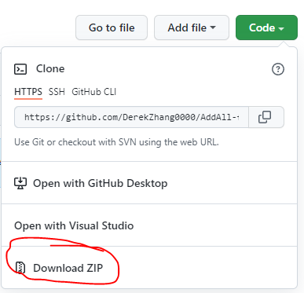
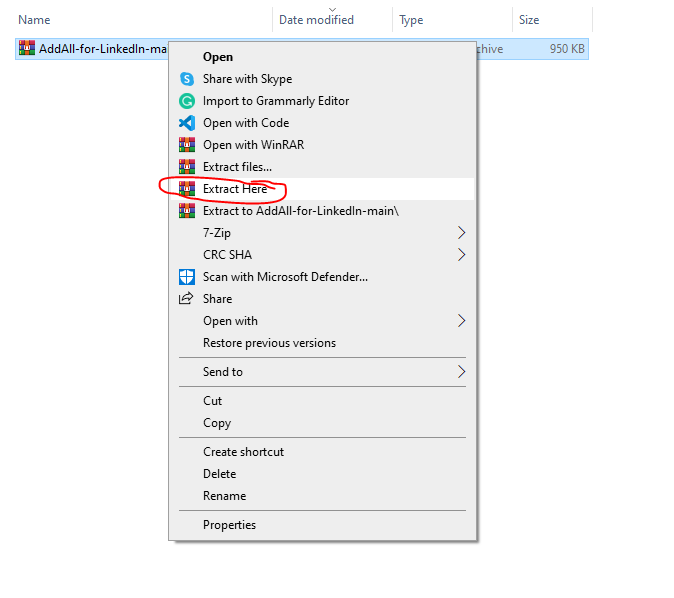
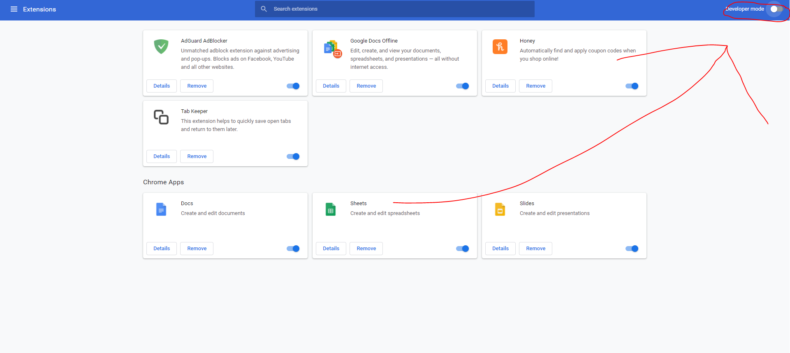
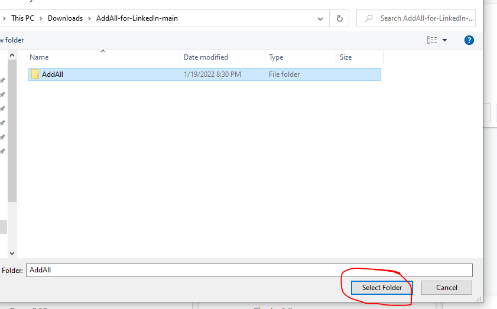

# AddAll for LinkedIn
Chrome extension that automatically sends connection requests to everyone on your network page

# Disclaimer and Warnings
- AddAll for LinkedIn is not associated with LinkedIn, and is only meant to be used in conjunction with it.
- LinkedIn may suspect your account is a bot if you use this extension too often.

# Setup:
1. Download zip file and extract it in its folder
 
2. Go to your extension dashboard in Google Chrome and enable developer mode

3. Click on "load unpacked" and select the folder
 

# Details
- Version: 1.1
- Author: Derek Zhang
- How to use: Navigate to your networks page on LinkedIn directly or navigate from another LinkedIn page and refresh.
- AddAll sends a request to all loaded connections every 2 seconds.
- AddAll does not send follow requests to organizations or influencers.
