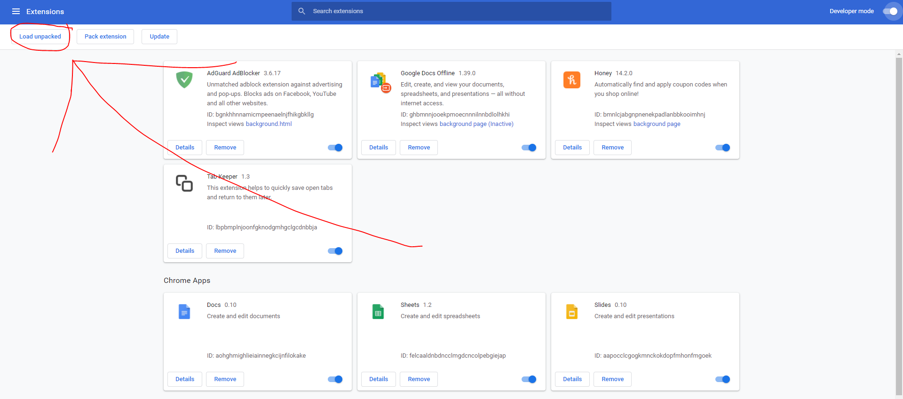

# AddAll for LinkedIn
Chrome extension that automatically sends connection requests to everyone on your network page

# Disclaimer and Warnings
- AddAll for LinkedIn is not associated with LinkedIn, and is only meant to be used in conjunction with it.
- LinkedIn may suspect your account is a bot if you use this extension too often.

# How to use:
1. Download zip file and extract it in its folder

2. Go to your extension dashboard in Google Chrome and enable developer mode

3. Click on "load unpacked" and select the folder
